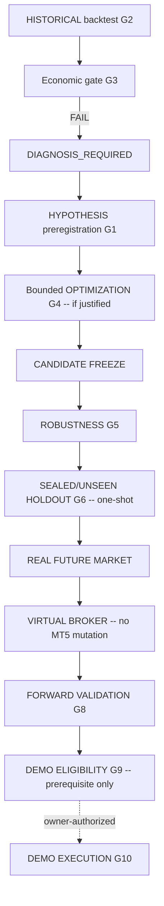

# SVOS Lifecycle and Gates — P2 / P18

The permanent SVOS flow, reconciled onto the repository's canonical authorities.

## Flow

Every transition requires evidence and is **never auto-advanced**
(`svos.lifecycle.evaluate_transition` enforces contiguous-prefix PASS + explicit
evidence refs + candidate freeze for G5+ + one-shot holdout).

## Lifecycle reconciliation (mission state → canonical gate)

| Mission state | Canonical gate / milestone |
| --- | --- |
| REGISTERED | `strategies/registry.yaml` + `lifecycle_registry` entry |
| DATA_ADMITTED | `validation_admission` PASS (pre-G0) |
| BASELINE_BACKTESTED | G2 PASS |
| ECONOMIC_GATE_PASS / FAIL | G3 PASS / FAIL |
| DIAGNOSIS_REQUIRED | G3 FAIL → diagnosis (no auto-optimize) |
| HYPOTHESIS_PREREGISTERED | G1 PASS |
| OPTIMIZATION_IN_PROGRESS | G4 |
| CANDIDATE_FROZEN | candidate freeze artifact (`svos.candidate`) |
| ROBUSTNESS_PASS / FAIL | G5 PASS / FAIL |
| HOLDOUT_AUTHORIZED / PASS / FAIL | G6 (one-shot) |
| FORWARD_ELIGIBLE / VALIDATING / PASS / FAIL | G8 |
| DEMO_ELIGIBLE | G9 PASS (prerequisite only) |

`LifecycleStage` (via `lifecycle_registry`) remains the **only** lifecycle authority;
these gates are subordinate validation evidence.

## Required distinctions (P18)

- `BACKTEST ≠ FORWARD TEST` — historical replay consumes admitted historical data;
  forward validation consumes real future market data strictly after campaign freeze.
- `VIRTUAL FORWARD ≠ MT5 DEMO` — the VirtualBroker has zero reach to order mutation.
- `FRICTION PROXY ≠ HISTORICAL FRICTION` — modeled/proxy costs are labeled, never
  conflated with broker-evidenced friction.
- `PROPOSAL ≠ ORDER` — a forward proposal is a virtual order, never a broker order.
- `DEMO_ELIGIBLE ≠ DEMO_EXECUTED` — G9 is a prerequisite; demo execution remains
  separately owner-authorized; live remains unauthorized.

## Components (src/svos/)

| Module | WP | Responsibility |
| --- | --- | --- |
| `authority.py` | 1 | frozen domain authority map + adjudication guard |
| `lifecycle.py` | 1 | mission-state reconciliation + transition guard |
| `historical_runner.py` | 2 | canonical historical runner (fail-closed on dataset/friction hashes) |
| `hypothesis.py` | 3 | frozen HypothesisContract (preregistration hash) |
| `optimization.py` | 3 | bounded optimizer (budgets + protected-data firewall) |
| `candidate.py` | 4 | candidate freeze + CANDIDATE_FINGERPRINT |
| `friction_profile.py` | 5 | component-state FrictionProfile (UNAVAILABLE ≠ zero) |
| `virtual_broker.py` | 5 | VirtualBroker + VirtualAccount/Order/Fill/Position/Trade/Ledger |
| `forward.py` | 6 | ForwardValidationCampaign + orchestrator (chronological/restart-safe) |
| `demo_eligibility.py` | 6 | DEMO_ELIGIBLE prerequisite projection (never executes) |
| `adapters/ssc.py` | 7 | SSC same-authority proof (historical ≡ forward) |

## Cross-track optimization program binding (2026-09-24)

`src/strategy_optimization/` is a **non-authorizing program-control wrapper** for a
strategy-isolated experiment registry. It reuses the contracts and authorities above:
`svos.hypothesis` for preregistration, `svos.candidate` for a later freeze,
`svos.optimization` for bounded search, the existing signed optimization-admission
evaluator, `performance` for metric calculation, and
`validation_framework.lifecycle_registry` for the sole canonical strategy lifecycle.

Its `CandidateState` values describe only an experiment's research progress; they do not
create or mutate `LifecycleStage`. Its dataset-role vocabulary preserves the distinctions
between development, reused development, replication, OOS, final holdout, and forward
shadow while mapping only development roles to the existing optimizer. Protected access
is routed through the framework's pre-read ledger and is never silently downgraded.

The control-plane bootstrap and the first LSR Task C registration are documented in
[`docs/status/AG_STRATEGY_OPTIMIZATION_FRAMEWORK_V1_STATUS.md`](../status/AG_STRATEGY_OPTIMIZATION_FRAMEWORK_V1_STATUS.md).
The optimization-admission contract remains `PROPOSED`; no search is authorized by this
program, and Task C is terminally `BLOCKED_REPRODUCIBILITY` until its exact population
and friction provenance are reproduced.
